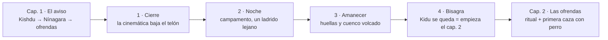

# IDEAS Y BOCETOS — Adapa y el diluvio

> Documento de **trabajo**: aquí van las ideas, los bocetos de escena y las
> decisiones que aún no son canon. No describe código ni sistemas: sólo guion.
>
> Relación con el resto:
> * `docs/GUION-NARRATIVO.md` — **canon**. Lo que ya se cuenta en el juego.
> * `docs/IDEAS-Y-BOCETOS.md` — **este documento**: propuestas, dudas y bocetos.
>
> Leyenda: ✅ ya en el juego · 🟡 escrito, pendiente de meter · ◇ propuesta
> abierta (para decidir) · ❌ contradicción o confusión resuelta aquí.
>
> Última revisión: 2026-09-28

---

## Índice

1. [Decisión nueva: Kidu no aparece hasta el capítulo 2](#1-decisión-nueva-kidu-no-aparece-hasta-el-capítulo-2)
2. [Mapa de capítulos](#2-mapa-de-capítulos)
3. [Bocetos: el reencuentro con Kidu](#3-bocetos-el-reencuentro-con-kidu)
4. [Cómo enlazar el capítulo 1 con el capítulo 2](#4-cómo-enlazar-el-capítulo-1-con-el-capítulo-2)
5. [Semillas del capítulo 1 que se cobran en el capítulo 2](#5-semillas-del-capítulo-1-que-se-cobran-en-el-capítulo-2)
6. [Bocetos de diálogo (borrador)](#6-bocetos-de-diálogo-borrador)
7. [Notas de implementación (sin programar nada)](#7-notas-de-implementación-sin-programar-nada)
8. [Decisiones abiertas](#8-decisiones-abiertas)

---

## 1. Decisión nueva: Kidu no aparece hasta el capítulo 2

### 1.1 Aclaración de nombres (❌ resuelto)

Hay dos nombres que se parecen y conviene no mezclarlos nunca en los textos:

| Nombre | Quién es | Cuándo sale |
|---|---|---|
| **Kidu-Lam** | La aldea de Adapa, arrasada por los raiders de Gutium | Desde el prólogo (se nombra, no se visita al principio) |
| **Kishdu** el Anciano | NPC de historia. Encarga el aviso del diluvio | Capítulo 1 |
| **Kidu** | **El perro** que acompaña a Adapa | **A partir del capítulo 2** (decisión nueva) |

> La coincidencia «Kidu-Lam / Kidu» **no es un error y se va a explotar**: el
> perro lleva el nombre de la aldea porque era *su* perro, el de todos.

### 1.2 La regla

**Hasta el capítulo 2 no nos encontramos a Kidu.** Los capítulos 0 y 1 se juegan
sin compañero:

* El **prólogo** (campo, familia, patrulla) es Adapa solo con su casa.
* El **capítulo 1** (el aviso de Kishdu y el viaje a Nínagara) es un viaje
  solitario: es la parte del juego donde se aprende el bucle (labor, acopio,
  camino, trato con autoridades) sin nadie que resuelva nada por el jugador.
* El **capítulo 2** abre con la llegada de Kidu: a partir de ahí el perro es
  compañero, herramienta de caza y —esto es lo importante— **ancla de memoria**
  de Adapa (§7.3 del guion: a medida que pierde memoria, el perro es lo último
  que reconoce).

### 1.3 Por qué funciona (razones para dejarlo así)

1. **La soledad del prólogo se nota.** Hoy es una casa con familia y un objetivo
   que se cumple en un rato; sin perro, la ausencia se puede *oír* (ver §3.1).
2. **El capítulo 1 es una prueba de carácter.** Si Adapa ya tuviera un aliado
   fiel desde el minuto uno, el viaje largo a Nínagara perdería tensión.
3. **El reencuentro explica el tema.** Kidu no «se desbloquea»: es lo que
   sobrevivió de Kidu-Lam, igual que Adapa. Que aparezca justo cuando el mundo
   empieza a ser grande (capítulo 2) es el mensaje del juego.
4. **Cuesta cero en sistemas nuevos.** No hay que inventar nada: el motor ya
   tiene perro con su panel (venir, seguir/quieto, ataque, acariciar, dar
   comida) y ya tiene la línea `«Kidu, contigo no me siento solo.»`

### 1.4 Consecuencias a vigilar

* Ninguna línea de los capítulos 0–1 puede **nombrar** a Kidu ni darlo por hecho.
  Las alusiones van de refilón y sin nombre (§5).
* La ayuda de caza (ataque, cobrar piezas) no existe hasta el capítulo 2: si el
  capítulo 0–1 necesitara caza, hay que resolverla con trampas o con el propio
  Adapa.
* El panel de órdenes del perro no debería estar vacío ni visible antes de
  conocerlo: hasta el capítulo 2, Kidu no existe para el jugador.

---

## 2. Mapa de capítulos

Propuesta de rótulos para no confundir «acto» (bloque narrativo) con «capítulo»
(contador del juego). El motor ya numera capítulos (`window._storyChapter`), así
que esta tabla es la traducción a palabras.

| Cap. | Título | Qué se juega | Compañero | Estado |
|---|---|---|---|---|
| **0** | *El campo y la casa* | Prólogo: campo, familia, patrulla militar, amanecer | ✗ Adapa solo | ✅ |
| **1** | *El aviso* | Ruinas de Kidu-Lam → Kishdu → viaje → Sacerdotisa Enlil-Ama | ✗ Adapa solo | ✅ |
| **2** | *Las ofrendas* (y la crecida anunciada) | El ritual del templo, logística, primer aviso cruzado entre épocas | ✅ **entra Kidu** | ✅ / 🟡 |
| **3** | *Sincronía* | Crisis de tres botones (presa / zigurat / equilibrio) | ✅ | 🟡 |
| **4** | *Ecos persistentes* | Tres epílogos según la ruta | ✅ / ✗ según final | 🟡 |

### 2.1 Qué cambia con esto

* El **capítulo 2** deja de ser «el capítulo de las ofrendas» y pasa a ser
  también **el capítulo en el que Adapa deja de estar solo**. El ritual y el
  perro entran juntos: es la misma idea contada dos veces (reunir lo que queda).
* El **capítulo 1** gana una función nueva: es el capítulo que hay que **aguantar
  solo**, y por eso puede ser más duro (más camino, más niebla, menos ayuda).

---

## 3. Bocetos: el reencuentro con Kidu

Cuatro maneras de que aparezca. Cualquiera vale; la recomendada es la **A**.

### 3.1 Boceto A · «El perro de la aldea» ✅ recomendado

**Dónde:** campamento de Adapa en la primera noche del capítulo 2, a las afueras
de Nínagara (o en el camino, junto al río).

**Cómo:**

1. El jugador cierra el capítulo 1 (la ofrenda del templo) y pasa la noche.
2. De noche, **se oye un ladrido lejano** una vez. No hay marcador, no hay
   aviso: sólo sonido (esto es lo que hace que el capítulo 0 se sienta vacío
   *a posteriori*).
3. Al amanecer hay **huellas** alrededor del campamento y un cuenco volcado.
4. Siguiendo el rastro (o simplemente esperando un turno) aparece un perro
   flaco con **un collar de cuentas de hueso de Kidu-Lam**: el mismo tipo de
   cuenta que llevan los niños de la aldea.
5. Primer diálogo (reutiliza la línea que ya existe en el motor):
   > **ADAPA:** Kidu... contigo no me siento solo.

**Por qué funciona:** explica sin flashback que el perro es de la aldea, no pide
sistemas nuevos y convierte el collar en un objeto emocional reutilizable en el
final (en la ruta donde Adapa pierde la memoria, es lo último que reconoce).

**Variante de tono (◇):** que Adapa **no recuerde haber tenido un perro**. No lo
dice, pero titubea al decir su nombre. Encaja con la premisa de los cruces
(«Adapa ya ha cruzado antes»).

### 3.2 Boceto B · «Herido en el granero quemado»

**Dónde:** ruinas de Kidu-Lam, al principio del capítulo 2, si se decide que el
capítulo 2 vuelve al sur en vez de seguir al norte.

**Cómo:** un perro con la pata herida, tumbado en lo que fue el granero. Adapa
lo cura (2 vendas / 1 comida) y el perro lo sigue a partir de ahí.

**Contra:** repetir «vuelve a las ruinas» después del capítulo 1 hace que el
mapa parezca un péndulo. Guardarlo para el final (volver a cerrar el círculo).

### 3.3 Boceto C · «El que ya te seguía»

**Dónde:** en cualquier punto del camino a Nínagara, **pero mal**: se cruza con
Adapa y lo ignora, y vuelve a aparecer dos capítulos después.

**Cómo:** el perro no se presenta. Aparece tres veces de fondo (un bulto entre
los juncos, un ladrido cruzando el río, unas huellas junto a un pozo seco) y sólo
en el capítulo 2 se deja tocar.

**Por qué:** es el más «misterioso» y el más barato de sembrar, pero exige que el
jugador mire. Riesgo: que se lea como un fallo en vez de como una pista.

### 3.4 Boceto D · «Lo trae alguien»

**Dónde:** al entregar las ofrendas del capítulo 2, la sacerdotisa Enlil-Ama
entrega a Adapa un perro que encontraron los pastores del río.

**Cómo:** escena corta dentro del templo. El perro se llama Kidu porque **Adapa
le pone el nombre de su aldea** delante de la sacerdotisa.

**Por qué:** el nombre queda explicado en voz alta (no hay confusión con Kishdu)
y Enlil-Ama entra en la escena del perro, lo que refuerza su papel de autoridad
que da y quita. **Contra:** el perro llega como premio, no como recuerdo; se
pierde el «sobrevivió como yo».

### 3.5 Cuadro comparativo

| | A · El perro de la aldea | B · Herido | C · El que ya seguía | D · Lo trae el templo |
|---|---|---|---|---|
| Momento | Noche → amanecer del cap. 2 | Inicio del cap. 2 (si se vuelve al sur) | Goteo largo, se deja tocar en cap. 2 | Al entregar las ofrendas |
| Coste de escritura | Bajo | Medio | Medio | Bajo |
| Fuerza emocional | Alta | Media | Alta (si se entiende) | Media |
| Riesgo | — | sensación de péndulo | que parezca un fallo | que parezca un premio |
| Reutiliza el motor | ✅ línea y panel del perro ya existen | añade curación | añade apariciones | añade diálogo de templo |

---

## 4. Cómo enlazar el capítulo 1 con el capítulo 2

El capítulo 1 termina con la ofrenda entregada y una cinemática de capítulo. El
capítulo 2 empieza, hoy, sin transición: cambia el texto del objetivo y ya está.
Para que la entrada de Kidu (y de la «crecida anunciada») tenga sitio, se propone
un **puente de cuatro tiempos** que se juega, no se cuenta.

### 4.1 Tiempo 1 · Cierre del capítulo 1 (la cinemática actual)

Se mantiene la cinemática de capítulo, pero **se le añade un remate en silencio**
de dos o tres segundos: la cámara se queda en el río crecido. Es la primera vez
que el agua «se comporta raro» y el jugador lo ve sin que nadie se lo explique.
(Engancha con la Escena 9 del guion: la crecida anunciada.)

### 4.2 Tiempo 2 · La noche (el hueco donde falta algo)

* El juego sigue dejando al jugador hacer lo que quiera (objetivos libres ✅).
* Un **único sonido** de ladrido lejano, sin marcador, sin subtítulo ni icono.
* Si el jugador mira el horizonte, ve un punto que se mueve entre los juncos y
  desaparece. Nunca se confirma qué era.

### 4.3 Tiempo 3 · El amanecer (la pista, no el premio)

* Huellas alrededor del campamento (tres círculos, como si hubiera dado vueltas
  antes de decidirse).
* Un cuenco volcado y, si se inspecciona, **un mechón de pelo corto y claro**.
* Aquí sí puede aparecer una **pista suave** en el panel de objetivos libres
  (◇): «Algo ronda el campamento». Sin flecha grande ni cinemática.

### 4.4 Tiempo 4 · La bisagra (el perro como señal de que empieza otra cosa)

* Adapa sale a cazar (objetivo nuevo y sencillo: **la primera pieza del capítulo
  2**). Cazar sin perro es lento; con perro, inmediato. **El capítulo 2 se abre
  jugando a lo que Kidu sirve para hacer.**
* Kidu aparece mientras Adapa está distraído, se sienta a una distancia
  prudente, y sólo se acerca cuando Adapa deja de mirarlo.
* Se reutiliza la línea ya existente ✅:
  > **ADAPA:** Kidu... contigo no me siento solo.
* Un cartel sobrio (◇): **«Kidu se queda.»** — sin «compañero desbloqueado», sin
  fanfarria: es una decisión de guion, no una recompensa de MMO.

### 4.5 Tres bisagras alternativas (por si no gusta la del perro)

| Bisagra | Idea | Coste | Cuándo conviene |
|---|---|---|---|
| **Por objeto** | El collar de Kidu-Lam aparece en un mercado de Nínagara: alguien lo vendía. Adapa lo compra y, esa noche, algo con collar ronda el campamento | Bajo | Si se quiere que el jugador *pague* la bisagra |
| **Por voz / radio** | En 1926, un operador soviético oye a un perro ladrar en una frecuencia muerta; en Mesopotamia, esa misma noche, Adapa lo oye al otro lado del río | Medio | Si la bisagra se quiere usar también para presentar el cruce entre épocas |
| **Por pérdida** | El capítulo 1 cierra con Adapa enterrando a alguien de su casa (o perdiendo la última carta/tablilla). El perro llega el mismo día: algo que queda en vez de algo que se va | Medio-alto | Si se acepta que el capítulo 1 tenga un golpe duro |

### 4.6 Lo que NO debe hacer el puente

* ❌ Un texto emergente que diga «has desbloqueado al perro».
* ❌ Un marcador de misión que lleve de la mano hasta el perro (el jugador debe
  *encontrarlo*, aunque el objetivo libre lo insinúe).
* ❌ Que un NPC explique de quién es el perro antes de que el jugador lo mire.

---

## 5. Semillas del capítulo 1 que se cobran en el capítulo 2

La regla es sembrar sin nombrar. Todo lo de esta tabla se puede meter en el
capítulo 0–1 sin que el jugador entienda nada; en el capítulo 2 se relee.

| Semilla en el cap. 0–1 | Dónde | Cobro en el cap. 2 |
|---|---|---|
| Un cuenco de barro mordisqueado junto a la puerta de casa, sin explicación | Prólogo (casa) | Es el mismo tipo de cuenco que aparece volcado en el campamento |
| La madre dice «hoy no ha venido nadie a por las sobras», sin más | Diálogo familiar ✅ existente (añadir media línea 🟡) | El perro comía en esa casa |
| Las patrullas mencionan «animales sueltos por la orilla» | Briefing militar ✅ (ampliar 🟡) | Los perros de la aldea huyeron al saqueo |
| En las ruinas de Kidu-Lam, un poste con cadena rota | Escena de Kishdu ✅ | El collar era de ahí |
| Un ladrido lejano de noche, sin subtítulo | Cap. 1, noche | El de la noche del cap. 2 |

**Regla de escritura:** ninguna semilla puede ocupar más de una línea ni pedir
que el jugador haga algo. Son ruido de fondo con buena memoria.

---

## 6. Bocetos de diálogo (borrador)

> Borrador de trabajo: frases cortas, en la voz del juego. No es canon hasta que
> se marque 🟡/✅ en el guion.

### 6.1 Capítulo 0 · La familia, esa misma noche *(añadidos ◇)*

> **MADRE:** Hoy nadie ha venido a por las sobras de la puerta.
> **HERMANA:** Quizá se cansó de esperarnos.
> **ADAPA:** Quédate dentro, no te vayas a la orilla sola.

(Aquí el jugador puede pensar «¿quién, un mendigo?». En el capítulo 2 se
entiende.)

### 6.2 Capítulo 1 · Kishdu, en las ruinas *(añadido ◇)*

> **KISHDU:** Los perros de la aldea huyeron la noche del fuego. Los que no
> huyeron, no quiero pensar dónde acabaron.
> **ADAPA:** Yo tampoco.

### 6.3 Capítulo 1 · Sacerdotisa Enlil-Ama *(presagio ◇)*

> **ENLIL-AMA:** Los perros saben antes que los hombres. Si uno se te cruza en el
> camino, escúchalo: no hablará, pero no miente.

(Sirve de permiso narrativo: el jugador queda autorizado a hacer caso a un
animal sin que parezca fantasía.)

### 6.4 Capítulo 2 · La bisagra ✅ (línea ya existente en el motor)

> **ADAPA:** Kidu... contigo no me siento solo.

### 6.5 Capítulo 2 · Si Adapa pierde memoria (ruta C, epílogo) ◇

> **ADAPA:** No recuerdo tu nombre. Pero sé que no se me ha perdido por el
> camino: lo perdí antes de encontrarte.

---

## 7. Notas de implementación (sin programar nada)

Para cuando se decida, esto es lo que habría que tocar en el motor. **Hoy no se
toca nada.**

1. **Dónde entra ahora el perro.** El motor llama a `ensurePetDogCompanion()` al
   empezar partida nueva, así que Kidu está con Adapa desde el capítulo 0. Habría
   que **retrasar esa llamada** al arranque del capítulo 2 (el punto donde ya se
   llama a `advanceStoryChapter(2)`), que es el sitio natural.
2. **El panel del perro.** Las órdenes (venir, seguir/quieto, ataque, acariciar,
   dar comida) ya existen; sólo hay que **no mostrarlas** antes de conocerlo, para
   que el jugador no vea un panel de cosas que no puede hacer.
3. **El nombre.** `DEFAULT_PET_DOG_NAME = 'Kidu'` ✅ — ya es el correcto. La
   confusión con *Kishdu* y *Kidu-Lam* se resuelve por escritura (§1.1), no por
   código.
4. **La línea clave ya existe** («Kidu, contigo no me siento solo.») y se usa en
   los diálogos del perro: sirve tal cual como frase de presentación.
5. **Sonido y rastro.** El ladrido lejano y las huellas son decoración: un
   efecto de sonido ya existente a bajo volumen y un par de entidades de suelo.
   Nada de misiones nuevas.
6. **Objetivo libre nuevo (◇).** «Algo ronda el campamento» encaja con el sistema
   de objetivos libres ✅ y se completaría solo al acercarse al perro.
7. **Memoria de Adapa (§7.3 del guion).** Si algún día se implementa, el perro es
   el mejor candidato a «última cosa que Adapa reconoce»: no cuesta sistema nuevo,
   es texto en los umbrales de memoria.

---

## 8. Decisiones abiertas

- [ ] **Boceto de la aparición:** ¿A (el perro de la aldea) o alguna variante?
- [ ] **Tono:** ¿Adapa recuerda haber tenido un perro, o titubea al nombrarlo?
- [ ] **Capítulo 2:** ¿se juega en Nínagara o se vuelve al sur antes de entrar en
      el ritual? (afecta a si el boceto B sigue disponible)
- [ ] **Puente:** ¿los cuatro tiempos completos o sólo la noche + la bisagra?
- [ ] **Pista en el HUD:** ¿aparece el objetivo libre «algo ronda el campamento»
      o se deja completamente mudo?
- [ ] **Cartel «Kidu se queda»:** ¿se pone o se deja sin confirmación explícita?
- [ ] **Caza:** ¿la primera pieza del capítulo 2 exige perro (para notar la
      diferencia) o se puede hacer sin él?
- [ ] **Semillas:** ¿se meten las cinco de §5 o sólo dos (cuenco y ladrido)?
